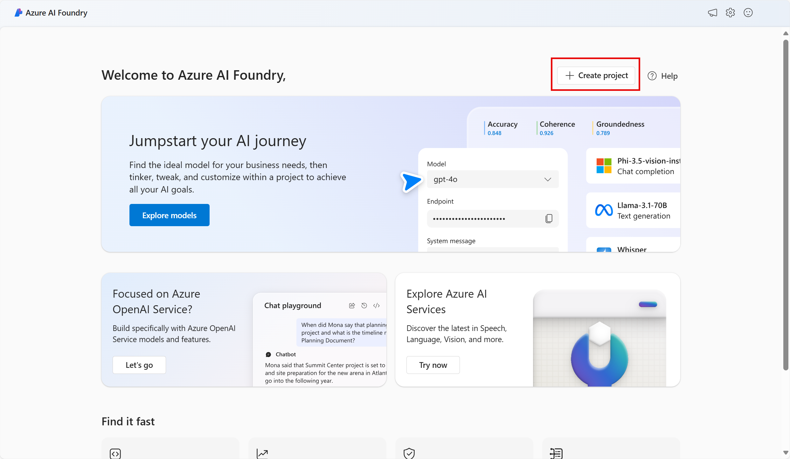
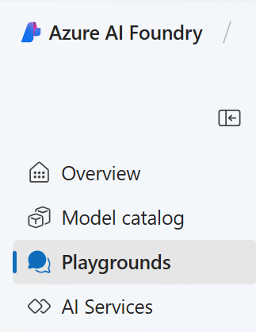

# projeto-dio-ai
## Análise de Sentimentos com Language Studio no Azure AI

Nesse laboratório testamos algumas funções de IA utilizando o Language Studio no Azure.  
 Processamento de Linguagem Natural (PLN), utilizando o serviço Azure AI Language. Ele abrange a criação de projetos na plataforma, onde é possível:

- Extrair entidades nomeadas (identificando pessoas, lugares e objetos no texto).

- Extrair frases-chave (isolando as informações mais importantes de uma avaliação).

- Resumir textos (gerando resumos automáticos de grandes volumes de texto).

O objetivo é utilizar esses recursos para analisar avaliações de hotéis, como parte de um exercício prático no portal do Azure. Além disso, o texto também orienta sobre como criar, configurar e excluir os recursos criados para evitar custos extras.

vejamos a seguir algumas imagens do passo a passo:

Na página inicial do portal do Azure AI Foundry, selecione Create a project . No Azure AI Foundry, os projetos são contêineres que ajudam a organizar seu trabalho.  

  
  No painel Criar um projeto , você verá um nome de projeto gerado, que pode ser mantido como está. Dependendo se você criou um hub no passado, verá uma lista de novos recursos do Azure a serem criados ou uma lista suspensa de hubs existentes. Se você vir a lista suspensa de hubs existentes, selecione Criar novo hub , crie um nome exclusivo para seu hub e selecione Avançar .

  
   Após os recursos serem criados, você será levado para a página Overview do seu projeto . No menu à esquerda na tela, selecione Playgrounds .
  No playground Language, selecione Extract information . Em seguida, selecione o bloco Extract named entities e lá poderemos fazer as nossas análises.

  ## Limpar
Se você não pretende fazer mais exercícios, exclua quaisquer recursos que não precise mais. Isso evita acumular custos desnecessários.

1. Abra o portal do Azure em https://portal.azure.com e selecione o grupo de recursos que contém os recursos que você criou.

2. Selecione os recursos e selecione Delete e depois Yes para confirmar. Os recursos são então excluídos.

## Fontes
https://microsoftlearning.github.io/mslearn-ai-fundamentals/Instructions/Labs/06-text-analysis.html
https://microsoftlearning.github.io/mslearn-ai-fundamentals/Instructions/Labs/09-speech.html
